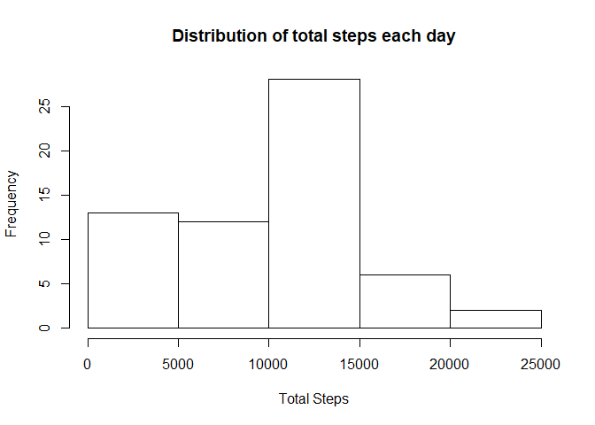
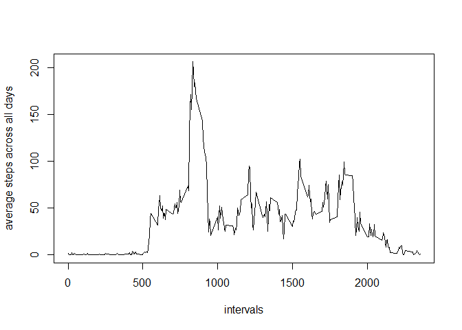
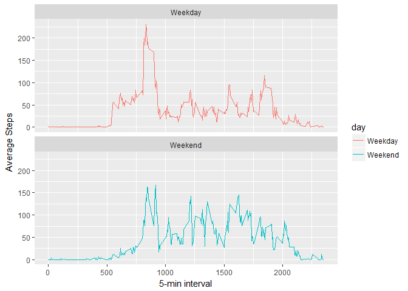

# Reproducible Research: Peer Assessment 1
Saikat Banerjee, dated 3rd Dec, 2017

### Synopsis
This data analysis makes use of the activity data of an user over two months. 
The analysis is focused on finding insights like average steps taken each day,
change in activity patterns between weekdays and weekends, etc.

### Loading and preprocessing the data

```r
download.file("https://d396qusza40orc.cloudfront.net/repdata%2Fdata%2Factivity.zip",
              destfile = "activity.zip", mode = "wb")

act <- read.csv(unzip("activity.zip"), header = T)

act$date <- as.Date(act$date)
```


### What is mean total number of steps taken per day?

```r
library(ggplot2)
library(dplyr)
```

```
## 
## Attaching package: 'dplyr'
```

```
## The following objects are masked from 'package:stats':
## 
##     filter, lag
```

```
## The following objects are masked from 'package:base':
## 
##     intersect, setdiff, setequal, union
```

```r
 #Calculate total steps taken by date
Total.steps <- act %>% group_by(date) %>% 
  summarise(Total.steps = sum(steps, na.rm = T))

hist(Total.steps$Total.steps, bins = 100, 
     main = "Distribution of total steps each day", 
     xlab = "Total Steps")
```

```
## Warning in plot.window(xlim, ylim, "", ...): "bins" is not a graphical
## parameter
```

```
## Warning in title(main = main, sub = sub, xlab = xlab, ylab = ylab, ...):
## "bins" is not a graphical parameter
```

```
## Warning in axis(1, ...): "bins" is not a graphical parameter
```

```
## Warning in axis(2, ...): "bins" is not a graphical parameter
```

<!-- -->

```r
mean(Total.steps$Total.steps, na.rm = T)
```

```
## [1] 9354.23
```

```r
median(Total.steps$Total.steps, na.rm = T)
```

```
## [1] 10395
```
The distribution shows that it is slightly skewed. The mean and median are 9354.23 and 10395 respectively.

### What is the average daily activity pattern?

```r
act.arranged = arrange(act, interval)

average.steps = act.arranged %>% group_by(interval) %>% 
  summarise(mean(steps, na.rm = T))

names(average.steps) <- c("intervals", "ave.steps")

plot(average.steps, type = "l", ylab = "average steps across all days")
```

<!-- -->

```r
# interval for maximum number of steps taken

max.id <- which(average.steps$ave.steps == 
        max(average.steps$ave.steps))

#Calculate the 5-min interval that gives maximum average steps
average.steps[max.id, ]$intervals
```

```
## [1] 835
```
The plot shows that the average steps daily follows an uneven distribution.It is also found that the peak activity is found at 835th interval in a day, on an average. 

### Imputing missing values

```r
# number of rows containing NAs
nrow(act) - sum(complete.cases(act))
```

```
## [1] 2304
```

```r
#data frame containing NAs and one that does not
act.na <- act[!complete.cases(act),]
act.free <- act[complete.cases(act), ]
na.id = which(!complete.cases(act) == T)

#Filling in the NAs with mean for that 5-min time interval
for(i in na.id){
  ave.temp = c()
  ave.temp = average.steps$ave.steps[average.steps$intervals == act$interval[i]]
  act[i,1] = ave.temp
  }
Total.steps <- act %>% group_by(date) %>% 
  summarise(Total.steps = sum(steps, na.rm = T))

hist(Total.steps$Total.steps, bins = 100, 
     main = "Distribution of total steps each day", 
     xlab = "Total Steps")
```

```
## Warning in plot.window(xlim, ylim, "", ...): "bins" is not a graphical
## parameter
```

```
## Warning in title(main = main, sub = sub, xlab = xlab, ylab = ylab, ...):
## "bins" is not a graphical parameter
```

```
## Warning in axis(1, ...): "bins" is not a graphical parameter
```

```
## Warning in axis(2, ...): "bins" is not a graphical parameter
```

<!-- -->

```r
mean(Total.steps$Total.steps, na.rm = T)
```

```
## [1] 10766.19
```

```r
median(Total.steps$Total.steps, na.rm = T)
```

```
## [1] 10766.19
```
There are various ways to replace missing values. Here, they are replaced with the average steps 
for the relevant 5-min time interval. The little skewness observed before is gone now. The distribution is more like a normal distribution. The mean and median comes out to be the same when we replace the missing values in this manner.

### Are there differences in activity patterns between weekdays and weekends?

```r
act$day <- weekdays(act$date)

for(i in 1:nrow(act)){
  if(act$day[i] == "Saturday" | act$day[i] == "Sunday"){
    act$day[i] <- "Weekend"
  }
  else{
    act$day[i] <- "Weekday"
  }
}

act.sub = act %>% group_by(interval, day) %>% summarise(avg.steps = mean(steps))
ggplot(data = act.sub, aes(x = interval, y = avg.steps)) + 
  geom_line (aes(col = day)) + facet_wrap(~ day, ncol = 1) + 
  ylab("Average Steps") + xlab("5-min interval")
```

<!-- -->

The plot clearly shows that there are differences in the average steps taken during weekdays and weekends. The average steps taken between 500 and 750th intervals are greater for weekdays than weekends. This may suggest that the user is getting ready in the morning to go to work on weekdays. After the usual surge of steps around 830th interval in either case, more steps are taken on weekends than weekdays. This may suggest that the user is at the gym during the weekend, owing to being more available on weekends.
